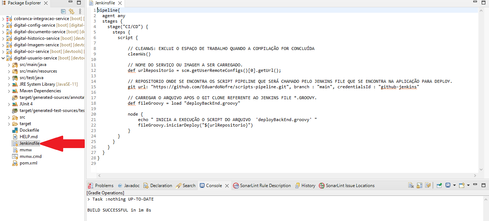

## Support & Feedback
Este projeto é mantido por Eduardo Nofre. Por favor, entenda que não poderemos fornecer suporte individual por e-mail. 
Acredito também que a ajuda é muito mais valiosa se for partilhada publicamente, para que mais pessoas possam beneficiar dela.

## O scripts pipeline
- Neste repositorio se encontra os scripts para fazer deploy da aplicação versão generica.

## Pipeline file
O pipeline file contem os passos para necessario para a publicação do projeto.
O Jenkins file um arquivo de texto que contém a definição de um Pipeline Jenkins e é verificado no controle de origem. Considere o pipeline entrega contínua de com estagios estágios.

## Service back-end
- Todos os serviços back-end tem que ter o arquivo chamado jenkins file.
  O jenkins file faz a chamada do deployBackEnd.groovy que é um script que deve conter algumas fase de publicação do Jenkins.

## Veja a imagem abaixo o arquivo jenkins file e seu conteudo.

- observe que na imagem acima o jenkinsFile aponta para um repositorio no github, neste diretorio o mesmo aponta para um determinado script.
  
## Com os seguintes passos:
 #### 1 -  Build: 
 - Construção do projeto compilação. 
 #### 2 - Code Quality - Sonar: 
 - Faz análise do códig.
 #### 3 - Quality Gate: 
 - Verifica se a aplicação atingiu porcentagem definida no sonar/status.
 #### 4 - Build Docke: 
 - Faz o build da imagem no docker compose.
 #### 5 - Publish Container 
 - Publica no ambiente desejado.

#### Obervação: os scripts aqui depositado devem ter a extensão *.groove.

### Exemplos do passos de publicação  de um projeto.

# Uma visão do jenkins

    
  
